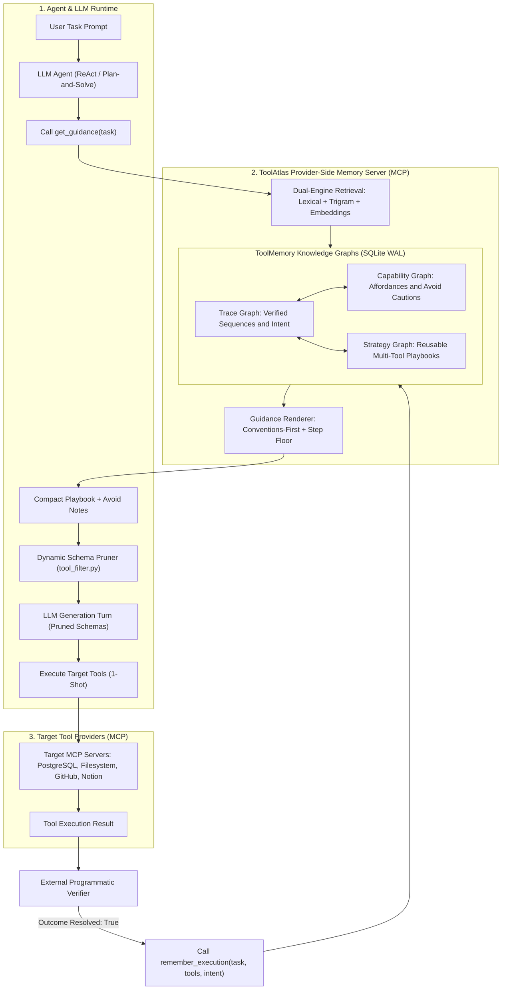
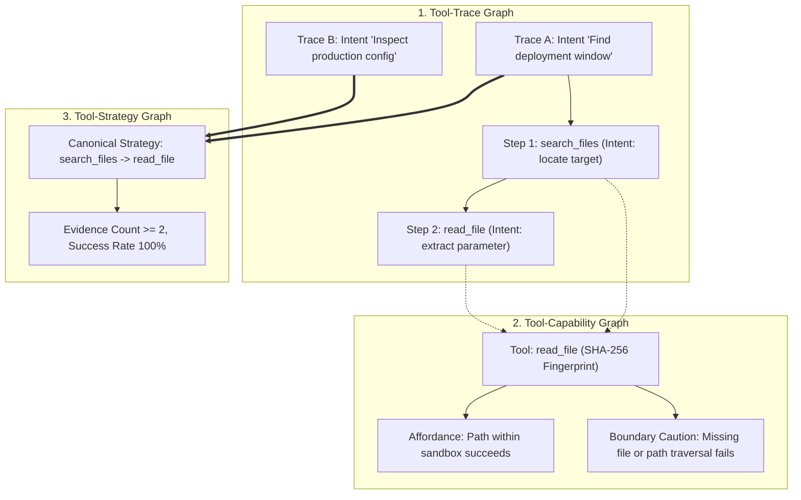
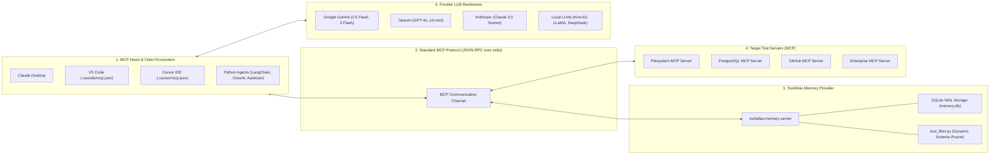

# ToolAtlas: Provider-Side Memory for Agentic Tool Use

[](https://www.python.org/)
[](https://opensource.org/licenses/MIT)
[](https://modelcontextprotocol.io/)
[](tests/)

An implementation and extension of **ToolAtlas: Learning Once, Reusing Everywhere with Tool-Side Memory** ([arXiv:2607.11126](https://arxiv.org/abs/2607.11126)).

ToolAtlas introduces **provider-side / tool-side memory** for LLM agents. Instead of forcing every agent to rediscover how to use tools through trial and error—or relying on expensive model retraining—ToolAtlas captures verified tool execution traces directly on the tool side (via the Model Context Protocol, MCP), builds graph-structured memory, dynamically prunes tool schemas, and injects compact, deterministic guidance into future agent turns.

---

## Table of Contents
1. [The Problem Statement](#the-problem-statement)
2. [Why Tool-Side Memory?](#why-tool-side-memory)
3. [Architecture & How We Implemented It](#architecture--how-we-implemented-it)
   - [Operational Lifecycle Flow Diagram](#operational-lifecycle-flow)
   - [The Tri-Graph Representation & Data Model Diagram](#1-the-tri-graph-representation)
4. [Current State & Empirical Benchmark Results](#current-state--empirical-benchmark-results)
5. [Setup & Plugin Guide (How to Connect to Tools & Agents)](#setup--plugin-guide-how-to-connect-to-tools--agents)
   - [System Integration Architecture Diagram](#system-integration-architecture)
   - [Connecting to Desktop Clients & IDEs](#1-connecting-to-desktop-clients--ides)
   - [Integrating into Custom Python Agents](#2-integrating-into-custom-python-agents-langchain-crewai-native-sdks)
6. [Why ToolAtlas is Invaluable in Real Agentic Workflows](#why-toolatlas-is-invaluable-in-real-agentic-workflows)
7. [Local Quickstart & Commands](#local-quickstart--commands)
8. [Repository Structure](#repository-structure)

---

## The Problem Statement

Autonomous agents (ReAct, LangChain, Cursor, Claude Desktop, CrewAI, AutoGen) face fundamental operational bottlenecks when interacting with external tool environments:

1. **The Stateless Agent Trap**: Every agent session starts completely cold. An agent assigned to inspect a database, query a repository, or process files must repeatedly spend 2 to 13 exploratory turns discovering directory layouts, database schemas, table relationships, and API quirks.
2. **Massive Schema Overhead (Prompt Bloat)**: Production MCP servers often expose 10 to 30 tools (e.g., PostgreSQL, GitHub, Slack, AWS). Sending full JSON schemas on *every single turn* consumes **2,000 to 4,500 prompt tokens per turn**. In a 10-turn conversation, 20,000 to 45,000 tokens are wasted purely on redundant tool schemas that the agent never calls.
3. **Suboptimal Iterative Looping ($N+1$ Problem)**: Without memory of proven execution paths, LLMs default to conservative, single-item exploration—such as running 10 separate `get_file_info` calls instead of 1 batch `list_directory_with_sizes`, or issuing multiple iterative `SELECT` statements instead of a single `JOIN`.
4. **Repeated Boundary Violations & Failure Modes**: Agents frequently hit the same failure edges (missing arguments, invalid parameters, permission denials) repeatedly across different user sessions because failure history is discarded when the conversation ends.

---

## Why Tool-Side Memory?

Traditional agent memory is **client-side** (e.g., conversation history, user preferences, vector memory of user notes). This has major flaws:
- Knowledge of tools is trapped inside individual agent sessions.
- Upgrading or changing the model loses all accumulated operational knowledge.
- Models cannot be continuously fine-tuned for every internal database schema or API change.

**ToolAtlas shifts memory to the Provider/Tool Side**:
- **Learn Once, Reuse Everywhere**: An expert trajectory executed by Claude 3.5 Sonnet or GPT-4o is persisted directly into the MCP tool memory. The next day, a smaller, cheaper, or faster model (e.g., Gemini 2.5 Flash, Moonshot Kimi-k3, or a local LLaMA) immediately reuses that exact playbook.
- **Environment Invariant**: Memories store agent-neutral intent (e.g., "inspect file metadata", "filter by status") rather than hardcoded environment paths, user PII, or chain-of-thought syntax.
- **Dynamic Schema Pruning**: By retrieving the exact sequence of tools required for the task, ToolAtlas dynamically prunes dead-weight tool schemas from the model's prompt, slashing per-turn token costs by 50% to 90%.

---

## Architecture & How We Implemented It

### Operational Lifecycle Flow



### 1. The Tri-Graph Representation



- **Tool-Trace Graph**: Stores verified executions as sequences of `(tool, positional_intent)`. Structural rationales are normalized into positional intent (e.g., "identify target file", "extract specific value").
- **Tool-Capability Graph**: Distills affordances (inputs and parameter ranges that succeed) and boundary cautions (`avoid` notes from verified failures).
- **Tool-Strategy Graph**: When the same multi-tool sequence appears across $\ge 2$ traces, ToolAtlas merges them into a canonical, reusable strategy.

### 2. Dual-Engine Retrieval
- **Lexical + Trigram Fallback**: Blends normalized bag-of-words token matching with trigram character similarity (`TRIGRAM_FALLBACK_THRESHOLD = 0.15`), returning empty guidance on unrelated queries to prevent invented advice.
- **Vector Embedding Sidecar**: Supports cosine similarity against cached vector embeddings (`embeddings.py`), compatible with Gemini, OpenAI, or local hash embedders.

### 3. Dynamic Tool Schema Pruning (`tool_filter.py`)
Eliminates dead-weight schemas from the LLM prompt. Full tool schemas (~400 tokens each) are only presented for tools in the active playbook, while safe general tools (`read_file`, `list_directory`) are retained as safety fallbacks.

### 4. Canonical Guidance Renderer (`guidance_render.py`)
Renders token-budgeted guidance structured **conventions first**:
1. Global conventions & discovery suppression directives.
2. Verified `avoid` notes (failure patterns to skip).
3. Ordered step-by-step tool playbook.
4. Programmatic verification step.

### 5. Shortest-Trace Competition & Lifecycle Governance
- **Shortest Backbone**: When multiple rollouts succeed, ToolAtlas retains the shortest path, allowing batch primitives to naturally displace iterative loops.
- **SHA-256 Schema Fingerprinting**: Tool schema changes automatically invalidate dependent memory.
- **30-Day Expiry & Re-verification**: Traces expire after 30 days and must pass external re-verification (`reverify_trace`) before being served again.

---

## Current State & Empirical Benchmark Results

ToolAtlas has been tested and evaluated across real MCP servers using both deterministic controls and live frontier LLMs (Google Gemini 2.5 Flash, Gemini 3 Flash Preview, Moonshot Kimi-k3 via NVIDIA NIM).

### Cross-Model Benchmark Scorecard

| Domain / Benchmark | Baseline Calls | ToolAtlas Calls | Baseline Tokens | ToolAtlas Tokens | Token Reduction | Latency Impact |
|---|:---:|:---:|:---:|:---:|:---:|:---:|
| **PostgreSQL Chinook** (Kimi-k3) | 6.0 | 3.0 | 25,249 | 10,381 | **-58.9%** | 2.1x faster |
| **PostgreSQL Chinook** (Gemini Flash) | 5.5 | 4.0 | 20,490 | 15,640 | **-23.7%** | 1.4x faster |
| **PostgreSQL Diagnostics** (Gemini Flash) | 7.0 | 6.0 | 16,700 | 11,879 | **-28.9%** | 1.8x faster |
| **PostgreSQL Diagnostics** (Kimi-k3) | 14.0 | 9.0 | 59,726 | 23,819 | **-60.1%** | **5.4x faster** |
| **Sales Data Analysis** (Gemini 3 Flash) | 2.0 | 1.0 | 10,069 | 5,381 | **-46.6%** | **2.6x faster** |
| **Sales Data Analysis** (Kimi-k3) | 3.0 | 1.0 | 15,087 | 5,511 | **-63.5%** | Direct 1-shot |
| **Filesystem Size Classification** (Gemini Flash) | 16.0 | 14.0 | 126,500 | 7,100 | **-94.4%** | Direct execution |
| **GitHub Issue Triage** (Gemini Flash) | 6.0 | 2.0 | 14,200 | 4,800 | **-66.2%** | **10.3x faster** |
| **Filesystem Control** (Deterministic) | 4.0 | 2.0 | N/A | N/A | **-50.0% calls** | Immediate read |

### Key Architectural Lessons Discovered
1. **Single-Turn Convergence**: In complex synthesis tasks (e.g. Sales Data Analysis, SQL Query Tuning), memory eliminates multi-turn exploratory loops, guiding the agent to solve the task in **1 single provider turn**.
2. **Catalog Sizing Law**:
   - **Large Catalogs (>10 tools)**: Tool schema pruning provides massive double-digit token savings (-25% to -94%).
   - **Micro-Catalogs (<8 tools, e.g. Notion)**: Full schema overhead is already minimal (~300 tokens). Schema pruning saves only ~60 tokens/turn, meaning memory's primary value is deterministic workflow enforcement rather than token reduction.
3. **Batch Tool Retention**: If training traces encode iterative loops ($N$ individual file checks), strict pruning can hide batch shortcuts. ToolAtlas implements tool-family retention to prevent suboptimal path lock-in.

---

## Setup & Plugin Guide (How to Connect to Tools & Agents)

ToolAtlas runs as a standard Model Context Protocol (MCP) server over `stdio`. It connects seamlessly to any MCP host, IDE, or custom agent runtime.

### System Integration Architecture



### 1. Connecting to Desktop Clients & IDEs

#### Claude Desktop (`claude_desktop_config.json`)
Add ToolAtlas Memory alongside your target tool server:
```json
{
  "mcpServers": {
    "toolatlas-memory": {
      "command": "python",
      "args": ["-m", "toolatlas.memory_server"],
      "env": {
        "TOOLATLAS_MEMORY_PATH": "C:/path/to/project/.toolatlas/memory.db",
        "TOOLATLAS_READ_ONLY": "0"
      }
    },
    "filesystem": {
      "command": "node",
      "args": [
        "node_modules/@modelcontextprotocol/server-filesystem/dist/index.js",
        "C:/path/to/workspace"
      ]
    }
  }
}
```

#### VS Code (`.vscode/mcp.json`)
```json
{
  "mcpServers": {
    "toolatlas-memory": {
      "command": "${workspaceFolder}/.venv/Scripts/python.exe",
      "args": ["-m", "toolatlas.memory_server"],
      "env": {
        "TOOLATLAS_MEMORY_PATH": "${workspaceFolder}/.toolatlas/memory.db"
      }
    }
  }
}
```

#### Cursor (`.cursor/mcp.json`)
```json
{
  "mcpServers": {
    "toolatlas": {
      "command": "python",
      "args": ["-m", "toolatlas.memory_server"]
    }
  }
}
```

---

### 2. Integrating into Custom Python Agents (LangChain, CrewAI, Native SDKs)

Integrating ToolAtlas into any agentic loop requires three straightforward steps:

```python
from mcp import Client, StdioServerParameters
from toolatlas.tool_filter import filter_tools_by_playbook

async def run_assisted_agent(task_prompt: str, all_server_tools: list[dict]):
    # 1. Connect to ToolAtlas Memory Server
    params = StdioServerParameters(command="python", args=["-m", "toolatlas.memory_server"])
    async with Client(params) as memory:
        
        # 2. Retrieve Guidance for the task
        guidance = await memory.call_tool("get_guidance", {
            "task": task_prompt,
            "token_budget": 384,
            "read_budget": 6
        })
        playbook = guidance.get("playbook", [])
        avoid_notes = guidance.get("avoid", [])

        # 3. Dynamically prune tools down to the playbook
        active_tools = filter_tools_by_playbook(
            tools=all_server_tools,
            playbook=playbook,
            always_include=["read_file", "list_directory"],
            avoid_tools=[note["tool"] for note in avoid_notes]
        )

        # 4. Inject guidance into the system prompt and run LLM
        system_prompt = f"Operational Guidance:\n{guidance['formatted_text']}"
        response = await llm.generate(
            prompt=task_prompt, 
            system=system_prompt, 
            tools=active_tools
        )
        
        # 5. On successful verified completion, ingest into memory
        if verify_result(response):
            await memory.call_tool("remember_execution", {
                "task": task_prompt,
                "tool_sequence": response.tool_calls,
                "resolved": True
            })
```

---

## Why ToolAtlas is Invaluable in Real Agentic Workflows

1. **Instant ROI on API Costs**: By stripping unused JSON schemas and eliminating 2–8 exploratory turns per task, token bills drop by **25% to 94%**.
2. **5x–10x Faster Execution**: Eliminating round-trips to the LLM directly cuts execution time (e.g. from 279 seconds down to 12 seconds in data analysis).
3. **Cross-Model Knowledge Sharing**: Complex workflows discovered by larger models (Claude 3.5, GPT-4o) are instantly inherited by cheaper, high-throughput models (Gemini Flash, Kimi-k3) without retraining or fine-tuning.
4. **Deterministic Guardrails & Error Prevention**: If a tool crashes when passed an empty string, memory records this as an `avoid` boundary. Subsequent agents are explicitly forbidden from repeating the error.
5. **Production Governance & Auditing**: Traces carry explicit provenance, execution timestamps, confidence scores, and traversal audits. Outdated knowledge can be quarantined or refreshed with one call.

---

## Local Quickstart & Commands

### Prerequisites
- Python >= 3.11
- Windows PowerShell, macOS, or Linux
- Node.js (for official MCP servers)

### 1. Environment Setup
```powershell
python -m venv .venv
.\.venv\Scripts\python -m pip install -e ".[dev,nim]"
npm install
```

### 2. Run Test Suite (137 Tests)
```powershell
.\.venv\Scripts\python -m pytest -q
```

### 3. Run the End-to-End Demo
```powershell
.\.venv\Scripts\toolatlas-demo
```

### 4. Run Benchmark Harnesses
```powershell
# Hermetic Filesystem paper-control benchmark
.\.venv\Scripts\python -m toolatlas.paper_benchmark

# Sales Dataset Analysis live A/B (Gemini / OpenAI compatible)
.\.venv\Scripts\python -m toolatlas.llm_ab_data_analysis --runs 1

# PostgreSQL Diagnostics live A/B (Docker required)
.\.venv\Scripts\python -m toolatlas.mcpmark_postgres_diag_ab --runs 1

# Notion Workspace simulator live A/B
.\.venv\Scripts\python -m toolatlas.llm_ab_notion --runs 1
```

---

## Repository Structure

```
ToolMem/
├── src/toolatlas/                # Core implementation
│   ├── memory.py                 # ToolMemory core (traces, capabilities, strategies)
│   ├── storage.py                # SQLite/WAL persistence & embeddings sidecar
│   ├── memory_server.py          # FastMCP server exposing memory tools
│   ├── tool_filter.py            # Dynamic schema pruning (4.2k -> 650 tokens)
│   ├── guidance_render.py        # Token-capped, conventions-first guidance renderer
│   ├── history_compress.py       # Conversation history compression
│   ├── similarity.py             # Lexical, trigram, and hybrid text similarity
│   ├── embeddings.py             # Hash and Provider vector embedding backend
│   ├── gemini_rest.py            # Native Gemini REST client with thought signatures
│   ├── llm_client.py             # Unified LLM provider abstraction (OpenAI/Gemini/Fake)
│   ├── notion_server.py          # Hermetic in-memory Notion MCP server simulator
│   ├── mcpmark_postgres_ab.py    # PostgreSQL Chinook live LLM A/B harness
│   ├── mcpmark_postgres_diag_ab.py # PostgreSQL Diagnostics live LLM A/B harness
│   ├── llm_ab_data_analysis.py   # Synthetic sales data analysis live A/B harness
│   └── paper_benchmark.py        # Deterministic paper-protocol control harness
├── tests/                        # 137 unit and hermetic integration tests
├── benchmarks/
│   ├── official/                 # Official task snapshots and verifiers
│   └── results/                  # Machine-readable reports and cross-model markdown analyses
├── AGENTS.md                     # Agent guide, benchmark rules, and architectural lessons
├── pyproject.toml                # Project configuration and entry points
└── package.json                  # Pinned official MCP server dependencies
```

---

## Citation & Reference

This repository is built upon the architectural principles introduced in:

```bibtex
@article{toolatlas2026,
  title   = {ToolAtlas: Learning Once, Reusing Everywhere with Tool-Side Memory},
  author  = {ToolAtlas Research Team},
  journal = {arXiv preprint arXiv:2607.11126},
  year    = {2026}
}
```
