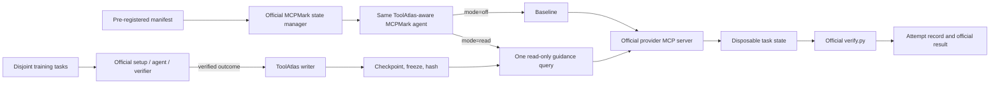

# MCPMark plan for testing ToolAtlas

Prepared: 2026-09-19  
Scope: planning only; no benchmark runs are authorized or performed by this document.

## Executive decision

Do not use the current custom `mcpmark_file_property_ab.py` or
`mcpmark_postgres_ab.py` harnesses as the primary evidence for ToolAtlas.
Preserve them as prototype and diagnostic experiments, but move the real
evaluation onto a pinned copy of the official MCPMark runner.

The correct comparison is:

1. official MCPMark task setup;
2. the same official MCPMark agent implementation in both arms;
3. official MCP provider tools;
4. official task verifier and cleanup;
5. disjoint training and evaluation tasks;
6. frozen, read-only ToolAtlas memory during evaluation; and
7. four fresh attempts per evaluation task, with complete cost and call
   accounting.

The first reportable experiment should be a **ToolAtlas A/B on the MCPMark
Verified Filesystem standard suite**, not a full MCPMark leaderboard claim and
not a full reproduction of the ToolAtlas paper.

## What the documentation establishes

The live MCPMark documentation describes a lifecycle of setup, agent execution,
programmatic verification, and cleanup in an isolated environment. Tasks are
defined by `meta.json`, `description.md`, and `verify.py`. The official pipeline
supports task/category selection, repeated runs, auto-resume, result aggregation,
and Docker execution. The current repository makes the Verified standard task
set the default and exposes `MCPMarkAgent` and `ReActAgent` through an agent
registry.

For implementation, use the pinned repository revision as the executable
authority. The website is useful for the intended workflow, but it can lag the
code and task assets.

This review used upstream commit
[`cd45b7f57923b9b3985467f5139927575f83141c`](https://github.com/eval-sys/mcpmark/tree/cd45b7f57923b9b3985467f5139927575f83141c),
whose commit date is 2026-06-12. At that revision, the standard suite contains
127 verifier-backed tasks:

| Service | Standard tasks |
|---|---:|
| Filesystem | 30 |
| GitHub | 23 |
| Notion | 28 |
| Playwright | 4 |
| Playwright-WebArena | 21 |
| Postgres | 21 |
| **Total** | **127** |

Re-resolve the upstream revision when implementation begins. If a newer
Verified release is selected, record its full commit SHA and do not combine its
results with this reviewed revision.

## Why the current setup is not sufficient

| Current component | What it proves | Why it is not the main ToolAtlas evaluation |
|---|---|---|
| `benchmarks/docker/mcpmark_replay.py` | An official size-task snapshot and verifier can be exercised deterministically through Filesystem MCP. | It is a scripted policy, not an independent LLM rollout, and it has no ToolAtlas arm. |
| `src/toolatlas/mcpmark_file_property_ab.py` | A real model can run two copied file-property tasks with baseline and memory-assisted prompts. | It uses a custom agent loop, trains and evaluates on the same two tasks, uses memory in-process, and does not use the official MCPMark lifecycle. |
| `src/toolatlas/mcpmark_postgres_ab.py` | A real model can run the copied Chinook task against an official backup and verifier. | It is a one-task, same-task-reuse custom harness rather than the official pipeline or a held-out evaluation. |
| `src/toolatlas/paper_benchmark.py` | A deterministic local control demonstrates structural call elimination with disjoint fixtures. | It is explicitly not MCPMark and is not an LLM-agent effectiveness test. |
| `benchmarks/docker/run.ps1` | The local prototype has a useful isolated offline validation path. | It does not run the live official MCPMark agent evaluation. |

There are also concrete correctness and provenance problems to remove before a
new run:

- The local copied `time_classification/description.md` asks for creation time.
  The current Verified upstream task asks for **last modified time (mtime)**.
  The old mismatch that confounded the saved experiment has therefore been
  corrected upstream, while the local copy is stale.
- The file-property run trained twice on the exact tasks and snapshot later used
  for evaluation. Frozen memory does not make that a held-out test.
- The custom harnesses do not exercise the official `MCPMarkAgent`, task manager,
  state manager, auto-resume behavior, result layout, or aggregator.
- Tool calls that raise before the local logger appends the call can be omitted
  from counts.
- The saved Gemini run did not retain complete trajectories or full usage
  metadata, so causal and billing claims cannot be reconstructed.
- The assisted arm runs after the baseline arm rather than using a precommitted,
  counterbalanced schedule.
- A WAL-backed training database is copied with `shutil.copyfile`; there is no
  purpose-built checkpointed snapshot or read-only evaluation mode.
- `benchmarks/README.md` references a Filesystem smoke artifact that is no
  longer present. Historical references are not evidence unless the artifact
  exists and its provenance can be checked.

These limitations do not make the prototypes useless. They make them engineering
checks rather than the primary benchmark.

## Claim to target

The first publishable claim should be narrowly phrased:

> On a pre-registered, held-out subset of MCPMark Verified Filesystem tasks at
> commit `<sha>`, the same model and MCPMark agent were evaluated with ToolAtlas
> memory disabled versus a frozen ToolAtlas memory trained only on disjoint
> tasks. Outcomes were scored by the official task verifiers over four fresh
> attempts per task.

Do not call this:

- an official MCPMark leaderboard score;
- a full 127-task MCPMark result;
- a reproduction of the ToolAtlas paper;
- a cross-environment result unless environment instances are genuinely held
  out; or
- proof of lower cost unless training, provider, memory, token, and latency
  costs are all reported.

## Target architecture



The model must never receive the verifier, reference answer, source snapshot,
or memory-writing tools. The verifier and reset controller remain independent
of the agent.

## Experimental design

### 1. Benchmark source

- Use a clean checkout or image built from one full MCPMark commit SHA.
- Use the `standard` task suite, which is the Verified set at the reviewed
  revision.
- Build a local image from the pinned source or pin the official image by digest.
  Do not use a floating `latest` tag for reportable results.
- Record hashes for task files, downloaded state archives, provider MCP versions,
  the ToolAtlas wheel, the integration patch, and the final image.
- Run the official benchmark in Linux Docker or WSL2-backed Docker. Keep the
  current native-Windows harness only as a development aid.

### 2. First service and split

Start with Filesystem because it requires no third-party account and the official
state manager already gives each task a disposable copy of its category
environment.

At the reviewed revision, Filesystem has 30 standard tasks across 10 categories.
Create a deterministic **10 training / 20 evaluation** split:

1. group tasks by category;
2. compute `SHA256("toolatlas-mcpmark-filesystem-v1" + task_id)`;
3. choose the lowest-hash task in each category for training; and
4. assign every remaining task to evaluation.

This produces one training task per category and keeps every evaluation task ID
disjoint while retaining category coverage in training. Generate and commit the
exact manifest before any model run. Never change the split after seeing results.

Call this a **held-out-task, same-service/category-covered split**. MCPMark
categories are not automatically equivalent to the paper's environment
instances.

After the main experiment, an optional second manifest may hold out entire
Filesystem categories. With 10 categories, a deterministic four-category train
and six-category evaluation split approximates a 2:3 ratio. Label it a
**held-out-category proxy**, not a paper cross-environment reproduction.

### 3. Training protocol

- Use four fixed, independent training attempts per selected training task.
- Reset official task state and start a fresh conversation for every attempt.
- Run the same official task instruction and provider MCP tools used by MCPMark.
- Let the independent official verifier determine `resolved`.
- Ingest verified successful rollouts as affordance evidence. Ingest failed
  rollouts only as boundary/caution evidence.
- Store agent-neutral rationales and sanitize paths, task literals, account IDs,
  secrets, answer content, and other environment-specific data.
- Do not train until success and stop; that creates outcome-dependent training
  cost. Use the fixed attempt count and report every failure.
- Do not query evaluation outcomes while creating memory.
- If the evidence threshold does not produce a strategy, leave it absent. Do not
  add a hand-written hint.

Training is an offline construction cost and must be reported separately. It is
not charged to the baseline arm, but any break-even statement must include it.

### 4. Freeze protocol

The existing storage layer opens SQLite in WAL mode and initializes writable
schema state. Add an explicit freeze path before evaluation:

1. stop the sole writer;
2. checkpoint and truncate WAL;
3. create the frozen database with SQLite's backup API;
4. validate it with `PRAGMA integrity_check`;
5. export logical memory statistics and a sanitized inventory;
6. hash the frozen database; and
7. reopen it through a read-only ToolAtlas server exposing retrieval and
   inspection only.

Prefer `mode=ro` plus `PRAGMA query_only=ON`, and exclude ingestion,
re-verification, governance mutation, and status-change tools from the evaluation
server. Record the database hash before and after the complete evaluation; they
must match.

### 5. Evaluation arms

Both arms must use the new ToolAtlas-aware MCPMark agent class so the code path
is the same.

| Setting | Baseline | ToolAtlas |
|---|---|---|
| Official task text | Same | Same |
| System prompt | Same | Same, plus fixed guidance block only when retrieval is non-empty |
| Model/provider/reasoning | Same | Same |
| Provider MCP server and schemas | Same | Same |
| Turn, token, and timeout budgets | Same | Same |
| Memory mode | `off` | `read` |
| Memory calls per attempt | 0 | Exactly 1 `get_guidance` |
| Memory mutation | Impossible | Impossible |
| Official verifier | Same | Same |

Use the exact official task instruction as the retrieval query, with only the
documented sanitizer needed to remove transient paths or identifiers. Apply one
fixed guidance template for the whole experiment. Save the complete retrieved
guidance and the final injected block for every assisted attempt.

If lexical similarity is zero, inject nothing. An empty retrieval is a valid
result, not an error to repair manually.

### 6. Attempts and ordering

- Run four independent evaluation attempts per task per arm.
- For 20 evaluation tasks, the main evaluation therefore contains 160 agent
  attempts: `20 tasks × 4 attempts × 2 arms`.
- Create a precommitted schedule keyed by `(task_id, attempt)`.
- Use a hash bit to select whether baseline or assisted runs first in each pair.
- Run paired arms close together, but reset official state and conversation
  between them.
- Give every attempt a unique immutable ID and output directory.
- Preserve failed, timed-out, verifier-failed, and infrastructure-error attempts.
- Never resume into an output directory created with another configuration.

MCPMark's native auto-resume is useful, but the wrapper must first compare a
complete manifest. Refuse resume on any model, provider, task, agent, memory,
prompt, budget, code, image, or schema mismatch.

## Integration design

### Use the official extension point

The official pipeline selects agents from `src.agents.AGENT_REGISTRY`. Add a
small pinned patch or maintained fork containing a `ToolAtlasMCPMarkAgent`, and
register it as `toolatlas`. The class should reuse `MCPMarkAgent` for model and
provider-tool execution rather than copying the current custom Gemini/OpenAI
loops.

Add explicit, provenance-visible options to the pipeline instead of relying on
unrecorded environment switches:

```text
--agent toolatlas
--toolatlas-mode off|learn|read
--toolatlas-memory PATH
--toolatlas-trace-dir PATH
--toolatlas-top-k N
--toolatlas-read-budget N
```

These flags are proposed integration work; they do not exist upstream today.

### Capture provider calls at the MCP boundary

Instrument the MCP server wrapper, not model-specific response parsing. For each
attempted call, write the event before awaiting the provider and then append its
result or exception. Capture:

- task, arm, attempt, and sequence number;
- provider and tool name;
- sanitized arguments;
- start/end monotonic timestamps;
- success, MCP error, exception, or timeout;
- sanitized result summary;
- tool schema hash and provider version; and
- whether the call was discovery, provider execution, or memory retrieval.

This fixes the current undercount of calls that raise exceptions and keeps
accounting consistent across model providers.

### Add a post-verifier learning hook

The agent cannot decide whether a rollout is correct. Add an optional evaluator
hook that runs only in `learn` mode after the official verifier and before
cleanup:

```text
on_verified_rollout(task, instruction, trace, verifier_result)
```

The hook sends the sanitized trace and independent verdict to the ToolAtlas
memory server over stdio. In `off` and `read` modes, the hook must be disabled
and the memory server must not expose write operations.

### Keep ToolAtlas MCP end to end

Run ToolAtlas memory as a real stdio MCP subprocess during training and assisted
evaluation. Do not use the in-process `Client(server)` shortcut in reportable
runs. The memory subprocess receives only its database path; it must not inherit
model or service credentials.

## Implementation phases and gates

### Phase 0 — Freeze scope and source

Deliverables:

- `upstream.lock.json` with repository URL, full commit SHA, image digest, and
  reviewed date;
- a generated inventory of the 127 standard tasks and the 30 Filesystem tasks;
- task, verifier, and state-archive hashes; and
- a written claim label for the experiment.

Gate:

- The upstream Verified `time_classification` task says mtime, not the stale
  local ctime text.
- No copied local task file is treated as authoritative.

### Phase 1 — Reproduce an unmodified official baseline

Run one stock official Filesystem task with `MCPMarkAgent`, `k=1`, and the
official setup/verify/cleanup lifecycle. Use a new output directory.

Gate:

- setup, provider MCP startup, agent execution, verifier, and cleanup all run;
- the task root is disposable and no host directory outside it is exposed;
- official `messages.json`, `execution.log`, `meta.json`, and summary artifacts
  are present; and
- credentials and host-local paths are absent from the shareable report.

This is a smoke test only, not ToolAtlas evidence.

### Phase 2 — Build the thin ToolAtlas integration

Deliverables:

- registered `ToolAtlasMCPMarkAgent`;
- explicit `off`, `learn`, and `read` modes;
- structured MCP-boundary tracing;
- post-verifier ingestion hook;
- read-only memory server/profile; and
- unit tests with a fake provider and fake verifier.

Gate:

- In deterministic tests, `toolatlas --mode off` produces the same prompt,
  listed provider tools, budgets, and provider calls as the official agent.
- A raised provider call is counted with its error.
- Evaluation modes cannot invoke any memory write tool.

### Phase 3 — Generate and freeze the manifest

Deliverables:

- exact 10/20 Filesystem split;
- exact four-attempt training and paired evaluation schedules;
- model and provider settings;
- prompt and guidance-template hashes;
- expected output paths; and
- a maximum spending/call budget set before execution.

Gate:

- A schema validator accepts the manifest.
- Changing any locked field forces a new experiment ID.

### Phase 4 — Engineering canary

Before the full run, execute a non-reportable canary with three training tasks,
six held-out evaluation tasks, and one attempt per arm.

Gate:

- every task begins from the official clean state;
- official verifiers run independently;
- training traces are ingested only after verification;
- frozen memory hash is unchanged after evaluation;
- baseline has no memory calls;
- assisted has exactly one guidance call;
- empty guidance remains empty; and
- all raw usage and trace fields needed by the report are populated.

Discard canary memory and results from the main experiment.

### Phase 5 — Full Filesystem A/B

Use a fresh experiment directory and fresh training database. Execute the locked
10/20 manifest and the precommitted arm schedule. Do not modify code, task assets,
prompts, or memory after the first main attempt. If a defect requires a change,
stop, preserve the failed run, increment the protocol version, and start again.

Gate:

- all scheduled attempts have a terminal status;
- no row was silently retried or removed;
- task state and conversation isolation checks pass;
- official arm-level aggregation succeeds; and
- the frozen memory hash remains unchanged.

### Phase 6 — Report and audit

Generate JSON, JSONL, CSV, and Markdown from the same immutable attempt records.
Run a secret and host-path scan before publishing.

Gate:

- all headline numbers can be recomputed from `attempts.jsonl`;
- summary denominators include failures and timeouts;
- training cost is separate and complete;
- provider calls and total MCP calls are both shown; and
- limitations and the exact claim scope appear in both JSON and Markdown.

### Phase 7 — Expand only after Filesystem passes

Recommended order:

1. Postgres, because database snapshots and programmatic verification are
   deterministic and local;
2. GitHub, using a dedicated private evaluation organization and disposable
   repositories;
3. Notion, using separate source and evaluation hubs;
4. Playwright and WebArena, with resettable site data and fresh browser contexts.

Use a separate pre-registered train/evaluation manifest and fresh memory database
for every service. Do not pool results across services until each service passes
its reset, verifier, trace, credential, and cleanup audits.

## Proposed repository layout

```text
benchmarks/mcpmark/
  README.md
  upstream.lock.json
  patches/
    0001-toolatlas-agent.patch
  manifests/
    filesystem-verified-v1.json
    filesystem-verified-v1.schedule.json
  schemas/
    manifest.schema.json
    attempt.schema.json
  scripts/
    fetch_and_verify_upstream.ps1
    generate_split.py
    run_training.py
    freeze_memory.py
    run_paired_ab.py
    aggregate.py
    audit_results.py
  docker/
    Dockerfile
    compose.yaml

benchmarks/results/mcpmark/<experiment-id>/
  manifest.json
  environment.json
  training_attempts.jsonl
  attempts.jsonl
  guidance/
  traces/
  official-results/
  report.json
  report.csv
  report.md

.toolatlas/mcpmark/<experiment-id>/
  training.db
  frozen.db
  frozen.sha256
```

The scripts and CLI names above are proposed deliverables, not existing commands.
Raw databases stay ignored and private. Only sanitized logical summaries and
hashes should be publishable.

## Command shape

First prove the stock runner at the pinned revision:

```bash
python -m pipeline \
  --mcp filesystem \
  --task-suite standard \
  --tasks file_property/size_classification \
  --models MODEL \
  --agent mcpmark \
  --exp-name stock-filesystem-smoke \
  --k 1
```

After implementing the integration, the wrapper should reduce to a small,
auditable interface such as:

```bash
python -m toolatlas_mcpmark.run_training \
  --manifest benchmarks/mcpmark/manifests/filesystem-verified-v1.json \
  --memory .toolatlas/mcpmark/EXP/training.db

python -m toolatlas_mcpmark.freeze_memory \
  --source .toolatlas/mcpmark/EXP/training.db \
  --output .toolatlas/mcpmark/EXP/frozen.db

python -m toolatlas_mcpmark.run_paired_ab \
  --manifest benchmarks/mcpmark/manifests/filesystem-verified-v1.json \
  --schedule benchmarks/mcpmark/manifests/filesystem-verified-v1.schedule.json \
  --memory .toolatlas/mcpmark/EXP/frozen.db \
  --output benchmarks/results/mcpmark/EXP
```

The wrapper must call the official setup, agent, verifier, and cleanup code; it
must not recreate those stages independently.

## Required attempt record

Every attempt should contain at least:

- experiment, protocol, upstream, image, ToolAtlas, and integration-patch IDs;
- service, suite, category, task ID, arm, attempt, and order;
- model alias, returned model ID, provider, reasoning setting, and budgets;
- task/verifier/state/tool-schema hashes;
- memory logical ID and frozen database hash;
- setup, agent, verification, cleanup, and total durations;
- official verifier exit status and sanitized output;
- all attempted provider calls, including failures;
- memory calls;
- discovery/handshake counts kept separate from tool invocations;
- complete available usage fields: prompt/input, output, reasoning/thinking,
  cached, total, and provider-reported cost when available;
- retrieved and injected guidance, including the empty case;
- terminal status classified as success, agent failure, verifier failure,
  timeout, setup failure, provider/MCP failure, or cleanup failure; and
- redaction status.

## Metrics and analysis

Use the official MCPMark aggregation semantics for each arm and add paired
ToolAtlas analysis.

Report:

- pass@1, pass@4, pass^4, and avg@4;
- successes and denominators, not percentages alone;
- paired per-task and per-attempt success deltas with bootstrap confidence
  intervals;
- provider tool calls;
- memory calls;
- total MCP tool invocations;
- discovery/handshake protocol operations separately;
- input, output, reasoning, cached, and total tokens where supplied;
- agent and end-to-end latency;
- model cost, service cost, and memory-construction cost;
- training calls/tokens/latency and an explicitly calculated amortization point;
- empty-retrieval rate and guidance coverage;
- failure categories; and
- results both including and excluding infrastructure failures, clearly labeled.

Do not advertise a provider-call reduction without showing total MCP calls. Do
not advertise token savings from incomplete usage fields. Do not treat fewer
calls on failed attempts as efficiency.

## Acceptance checklist

The main experiment is ready only when all items below are true:

- [ ] Upstream commit and container image are pinned.
- [ ] The 127-task inventory and the 30-task Filesystem inventory match the pin.
- [ ] Official tasks, verifiers, and state assets pass hash validation.
- [ ] Local stale copied tasks are not used.
- [ ] Stock official Filesystem smoke succeeds end to end.
- [ ] Both arms use the same ToolAtlas-aware MCPMark agent implementation.
- [ ] Baseline `mode=off` makes no memory calls.
- [ ] Assisted `mode=read` makes exactly one retrieval call per attempt.
- [ ] Memory writes are impossible during evaluation.
- [ ] Frozen database hashes match before and after evaluation.
- [ ] Training and evaluation task IDs are disjoint.
- [ ] Split and arm order were committed before model execution.
- [ ] Every attempt starts with clean official state and a fresh conversation.
- [ ] The model cannot access verifier code or reference answers.
- [ ] Raised and failed provider calls are recorded.
- [ ] Complete available token usage is retained.
- [ ] Resume rejects provenance mismatches.
- [ ] All scheduled failures remain in the denominator.
- [ ] Reports are reproducible from the attempt ledger.
- [ ] Secret and absolute-host-path scans pass.
- [ ] Report wording stays within the declared claim scope.

## Source index

- [MCPMark introduction and run modes](https://mcpmark.ai/docs/introduction)
- [MCPMark quick start](https://mcpmark.ai/docs/quickstart)
- [Task structure and verifier contract](https://mcpmark.ai/docs/datasets/task)
- [Filesystem setup and Docker recommendation](https://mcpmark.ai/docs/mcp/filesystem)
- [Pinned MCPMark README and Verified notice](https://github.com/eval-sys/mcpmark/blob/cd45b7f57923b9b3985467f5139927575f83141c/README.md)
- [Pinned pipeline CLI](https://github.com/eval-sys/mcpmark/blob/cd45b7f57923b9b3985467f5139927575f83141c/pipeline.py)
- [Pinned agent registry](https://github.com/eval-sys/mcpmark/blob/cd45b7f57923b9b3985467f5139927575f83141c/src/agents/__init__.py)
- [Pinned agent base and provider MCP configuration](https://github.com/eval-sys/mcpmark/blob/cd45b7f57923b9b3985467f5139927575f83141c/src/agents/base_agent.py)
- [Pinned evaluator lifecycle](https://github.com/eval-sys/mcpmark/blob/cd45b7f57923b9b3985467f5139927575f83141c/src/evaluator.py)
- [Pinned Filesystem standard tasks](https://github.com/eval-sys/mcpmark/tree/cd45b7f57923b9b3985467f5139927575f83141c/tasks/filesystem/standard)
- [Pinned corrected mtime task](https://github.com/eval-sys/mcpmark/blob/cd45b7f57923b9b3985467f5139927575f83141c/tasks/filesystem/standard/file_property/time_classification/description.md)
- [Pinned installation and Docker guide](https://github.com/eval-sys/mcpmark/blob/cd45b7f57923b9b3985467f5139927575f83141c/docs/installation_and_docker_usage.md)

## Definition of done

This plan is complete when one fresh, pinned Filesystem experiment produces a
fully auditable matched A/B report over the pre-registered 10/20 split, with four
attempts per evaluation task, official state management and verification,
read-only frozen ToolAtlas memory, complete attempt records, and no claim beyond
the evidence. Only then should the project spend effort on additional MCPMark
services or comparison with paper-level results.
